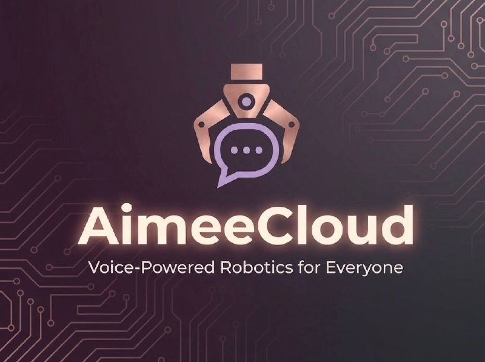
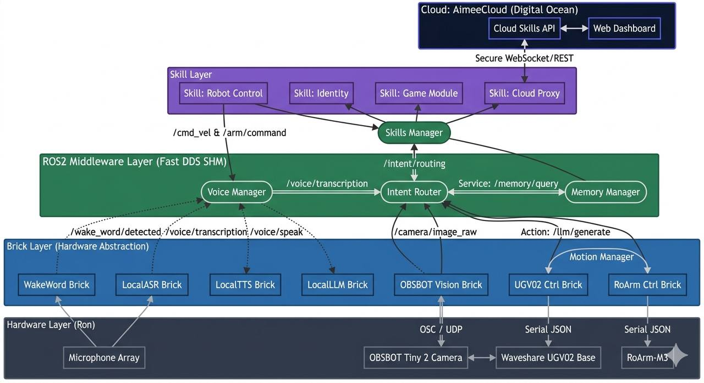

<div align="center">



# AimeeCloud

### Conversational AI for Physical Robots

*Give any robot natural voice conversation, games, vision, and personality — no onboard AI hardware required.*

[](LICENSE)
[](https://nodejs.org)
[](https://mqtt.org)
[](https://ai.google.dev)

</div>

---

## What is AimeeCloud?

**AimeeCloud is the AI-powered interactive layer for robots.** It is a cloud gateway that lets small, low-cost robots (Arduino UNO Q, ROS2 rovers, robotic arms, and similar platforms) gain natural conversation, real-time voice, capability-aware games, vision-driven actions, and an expressive personality — all without needing AI accelerators on the robot itself.

A robot connects to AimeeCloud over MQTT (and an optional audio WebSocket), advertises what hardware it has (motors, arm, gripper, camera, expressions), and the cloud tailors every response to that robot's exact capabilities. Manufacturers and hobbyists integrate once via the protocol, and their robots instantly speak, play, see, and react.

Because the platform negotiates capabilities at connect time, **the same cloud works with any robot** — from a display-only desk companion to a full mobile arm rover.

---

## Key Features

- **🎙️ Real-time voice conversation** — Bidirectional, low-latency audio streaming to an audio-native LLM (Gemini Live / OpenAI Realtime) over a WebSocket. No wake word required.
- **🧠 AimeeAgent LLM mode** — Natural-language requests are routed to an LLM that returns structured replies *plus* robot commands (move, snapshot, game move, expression) inline.
- **🎮 Capability-aware games** — Tic-Tac-Toe, Chess, Yahtzee, and Candyland that automatically adapt to `voice+snapshot`, `voice-only`, or `display-only` modes based on the robot's hardware.
- **✨ On-demand game generation** — The Game Creation Agent researches rules, generates a new JS game engine via LLM, sandbox-tests it, and registers it with the live gateway — no redeploy needed.
- **👁️ Vision & action** — Cloud-side object detection and a `pick_object` skill sequencer: voice → look pose → arm-camera snapshot → structured vision detection → `target_pixel` grasp.
- **📸 Selfie service** — `take_selfie` composes the robot's camera frame with a branded template, generates a QR code, and publishes a shareable viewer link.
- **🤖 Robot command routing** — Motors, arm waypoints, gripper, and expressions, all command-acknowledged and filtered to the robot's declared capabilities.
- **🗣️ Voice personas & TTS** — A persona registry maps abstract voices (`aimee-default`, `narrator`, `character-dragon`, …) to provider voice IDs, with a server→client TTS fallback chain.
- **🔁 Resilient sessions** — In-memory sessions with disk persistence survive gateway restarts; single-active-session-per-device with resume-on-reconnect and idle TTLs.
- **🔐 Auth & tiers** — SQLite-backed users, Google OAuth, JWT, per-robot API keys, and free/paid rate-limited tiers.
- **📷 Multi-camera support** — `front`/`navigation` and `arm`/`wrist` camera selectors for snapshots and video streaming.

---

## Architecture

<div align="center">

</div>

AimeeCloud sits in the cloud and talks to a robot's onboard stack over MQTT and an optional secure audio WebSocket. The robot handles its own sensors and actuators; AimeeCloud handles all of the intelligence.

```
   Robot / Browser test client
            │
            │  MQTT over TCP (1883)  ·  MQTT over WSS (443 → /aimeecloud-mqtt)
            │  Audio over WSS (wss://…/ws/v1)
            ▼
   ┌──────────────────────┐        ┌──────────────────────────────┐
   │   Mosquitto broker    │       │            Nginx              │
   │  TCP :1883 / WS :9001 │◀──────│  TLS, /ws/v1 & /aimeecloud-mqtt │
   └──────────┬───────────┘        └──────────────────────────────┘
              │
              ▼
   ┌────────────────────────────────────────────────────────────┐
   │                  aimeecloud-api-v3.js  (:3080)              │
   │   loads ▸ MQTT Gateway   ▸ Audio Gateway   ▸ Auth module    │
   │                                                            │
   │   • Sessions  • Intent router  • Function router           │
   │   • Game engines  • Vision  • Selfie  • Voice registry      │
   └───────┬───────────────────────────┬───────────────┬────────┘
           │                           │               │
           ▼                           ▼               ▼
   OpenRouter (text LLM)      Gemini Live (audio)   SQLite (auth/usage)
```

A single Node.js process (`aimeecloud-api-v3.js`) loads both the **MQTT gateway** (command-and-control, games, text agent) and the **audio gateway** (real-time voice), plus the shared auth module. MQTT remains the control plane even when audio streaming is active.

---

## How robots talk to AimeeCloud

### MQTT topics

| Direction | Topic | Purpose |
|-----------|-------|---------|
| Robot → Cloud | `aimeecloud/device/<id>/connect` | Session init / resume |
| Robot → Cloud | `aimeecloud/device/<id>/in` | Intents, game moves, agent requests, pings, snapshot responses |
| Cloud → Robot | `aimeecloud/device/<id>/out` | All responses (chat, game updates, commands) |
| Cloud → Robot | `aimeecloud/device/<id>/status` | Session lifecycle events |
| Cloud → Robot | `aimeecloud/device/<id>/system` | Operational messages (config, diagnostics) |

### Inbound message types

- **`connect`** — Creates or resumes a session. The robot advertises `capabilities`, `robot_config` (motors/arm/gripper/camera/expressions), `robot_name`, `robot_personality`, `gemini_voice`, and free-form `session_context`.
- **`intent`** — Keyword-classified request (robot movement, weather, news, story, game, help, …).
- **`AimeeAgent`** — Bypasses the keyword router and sends straight to the LLM, which can return both a reply and robot `commands`.
- **`game_move`** — A move for the active game engine.
- **`ping` / `disconnect`** — Keepalive and teardown.

### Outbound response sub-types

`chat_response` · `robot_command` · `game_update` · `aimee_agent` · `error`

Every outbound payload carries a resolved `voice` object so the robot knows how to speak the reply. Full schemas live in [`AIMEECLOUD_PROTOCOL.md`](AIMEECLOUD_PROTOCOL.md).

---

## Capability-aware design

Robots are not identical, so AimeeCloud never assumes hardware. At `connect`, the robot sends a `robot_config`, and the cloud:

1. **Filters function declarations** — only sends the LLM the actions the robot can physically perform.
2. **Selects game modes** — each engine picks `voice+snapshot`, `voice-only`, or `display-only`.
3. **Strips impossible commands** — `validateEngineCommands()` removes motor/drive commands for stationary robots.
4. **Degrades gracefully** — if a camera stalls mid-game, the engine auto-downgrades to `voice-only` and tells the player.

Game engines follow a **universal contract** (`name`, `displayName`, `modes`, `createState`, `makeMove`, `agentMove`, `buildResponse`, `normalizeState`, `reset`, `getHint`, `getRules`), so the gateway is fully engine-agnostic and can load new engines from disk at runtime.

---

## Tech stack

| Layer | Technology |
|-------|-----------|
| Runtime | Node.js (CommonJS) |
| Messaging | MQTT (`mqtt` npm) + Mosquitto broker |
| Real-time audio | WebSocket (`ws`) ↔ Gemini Live / OpenAI Realtime |
| Text LLM | OpenRouter (`google/gemini-2.5-flash-lite`) |
| Vision | OpenRouter / Gemini vision with strict JSON output |
| Database | SQLite3 (users, API keys, usage, game engines) |
| Auth | JWT, Google OAuth 2.0, per-robot API keys |
| Media | `sharp` (image compositing), `qrcode` (selfie QR) |
| TTS | ElevenLabs (server) → Lemonfox → gTTS (client fallback) |
| Reverse proxy | Nginx (TLS, WebSocket proxying) |
| Deployment | Bash (`deploy.sh`) + systemd |

---

## Repository layout

```
aimeecloud-deploy/
├── aimeecloud-api-v3.js          # HTTP/REST API + process entrypoint (:3080)
├── aimeecloud-mqtt-gateway.js    # MQTT gateway: sessions, intents, games, text agent
├── aimeecloud-audio-gateway.js   # Real-time audio WebSocket gateway
├── aimeecloud-auth.js            # Shared SQLite auth (users, OAuth, JWT, API keys)
├── function-router.js            # Audio-native LLM function calls → robot commands
├── audio-providers/              # Gemini Live + OpenAI Realtime adapters
├── services/
│   ├── vision.js                 # Cloud object detection (vision LLM)
│   └── selfie.js                 # Selfie compositing + QR + viewer link
├── game-creation-agent/          # On-demand engine generator (design → gen → sandbox → register)
├── voiceRegistry.json            # Persona → provider voice ID mappings
├── tier-config.json              # free / paid tier limits
├── deploy.sh                     # Copies to /workspace, reloads services
├── *.html                        # Web dashboard, test client, robot simulator
├── docs/openapi-spec.yaml        # OpenAPI 3.0 spec for the REST API
└── *.md                          # Protocol & specification docs
```

> Game engines are loaded at runtime from `/workspace/game-test/engines/` and are not stored in this repo.

---

## Getting started

### Prerequisites

- Node.js
- A Mosquitto MQTT broker (TCP `1883`, WebSocket `9001`)
- Nginx for TLS termination and WebSocket proxying
- API keys for the providers you intend to use (see configuration)

### Install & configure

```bash
git clone https://github.com/aimeesmallbeck/AimeeCloudServer.git
cd AimeeCloudServer
npm install

# Create your environment file from the template
cp .env.example .env   # then fill in real values
```

### Run (development)

```bash
# Source your env, then start the combined process
set -a; source .env; set +a
node aimeecloud-api-v3.js
```

`aimeecloud-api-v3.js` loads both the audio and MQTT gateways. **Do not** start a standalone `aimeecloud-mqtt-gateway.js` alongside it — that creates duplicate MQTT subscribers and double responses.

### Deploy (production-like)

```bash
sudo bash deploy.sh
```

The script copies code/config/HTML to `/workspace/` and the web root, reloads Mosquitto and Nginx, and restarts the Node process.

---

## Configuration

Copy [`.env.example`](.env.example) and fill in values:

| Variable | Purpose |
|----------|---------|
| `GEMINI_API_KEY` | **Required for audio streaming** (Gemini Live) |
| `OPENROUTER_API_KEY` | Vision analysis + game-creation agent |
| `OPENROUTER_HTTP_API_KEY` | HTTP API LLM |
| `JWT_SECRET` | JWT signing secret (use a strong random value) |
| `GOOGLE_CLIENT_ID` / `GOOGLE_CLIENT_SECRET` | Google OAuth (optional) |
| `ELEVENLABS_API_KEY` | Server-side TTS (optional) |
| `ADMIN_TOKEN` | Protects admin endpoints |
| `AIMEE_DEMO_KEY_FREE` / `AIMEE_DEMO_KEY_PAID` | Fallback demo API keys |
| `AIMEECLOUD_DB` | SQLite database path |

### Access tiers

| Tier | Sessions | API calls | TTS default |
|------|----------|-----------|-------------|
| `free` | 2 concurrent, 10/day | 5/min | client |
| `paid` | unlimited | unlimited | server |

API keys are validated against SQLite, with hardcoded demo fallbacks (`ac_free_demo_12345`, `ac_paid_demo_67890`) for testing.

---

## Testing

There is no formal build step or automated test suite — testing is manual.

- **Browser test client:** open `aimee/index.html` (served at `/aimee`) and send messages over MQTT-WS.
- **Robot simulator:** `aimee/robot-simulator.html` — toggle capabilities, use voice in/out panels, view the display screen, and inspect raw MQTT traffic.
- **MQTT CLI:**
  ```bash
  mosquitto_sub -h 127.0.0.1 -p 1883 -t "aimeecloud/device/+/out" -v
  mosquitto_pub -h 127.0.0.1 -p 1883 -t "aimeecloud/device/test-001/connect" \
    -m '{"type":"connect","capabilities":{"input":["text"],"output":["tts"]}}'
  ```

---

## Documentation

| Document | Purpose |
|----------|---------|
| [`AIMEECLOUD_PROTOCOL.md`](AIMEECLOUD_PROTOCOL.md) | Robot MQTT + audio protocol spec (messages, topics, voice, auth) |
| [`AIMEECLOUD_TECHNICAL_REVIEW.md`](AIMEECLOUD_TECHNICAL_REVIEW.md) | System overview for onboarding — start here |
| [`AIMEECLOUD_CLIENT_SPEC.md`](AIMEECLOUD_CLIENT_SPEC.md) | Robot firmware / ROS2 client contract |
| [`CAPABILITY_AWARE_GAME_ENGINES_PLAN.md`](CAPABILITY_AWARE_GAME_ENGINES_PLAN.md) | Capability-aware game engine design |
| [`PHYSICAL_EXPRESSIVENESS_SPEC.md`](PHYSICAL_EXPRESSIVENESS_SPEC.md) | Gesture / LED / motion expression vocabulary |
| [`VISION_ACTION_PLAN.md`](VISION_ACTION_PLAN.md) | Vision-driven detect & pick pipeline |
| [`AGENTS.md`](AGENTS.md) | Full developer/agent guide to the codebase |
| [`docs/openapi-spec.yaml`](docs/openapi-spec.yaml) | OpenAPI 3.0 spec for the REST API |

---

## License

Released under the [MIT License](LICENSE). © 2026 aimeesmallbeck.
